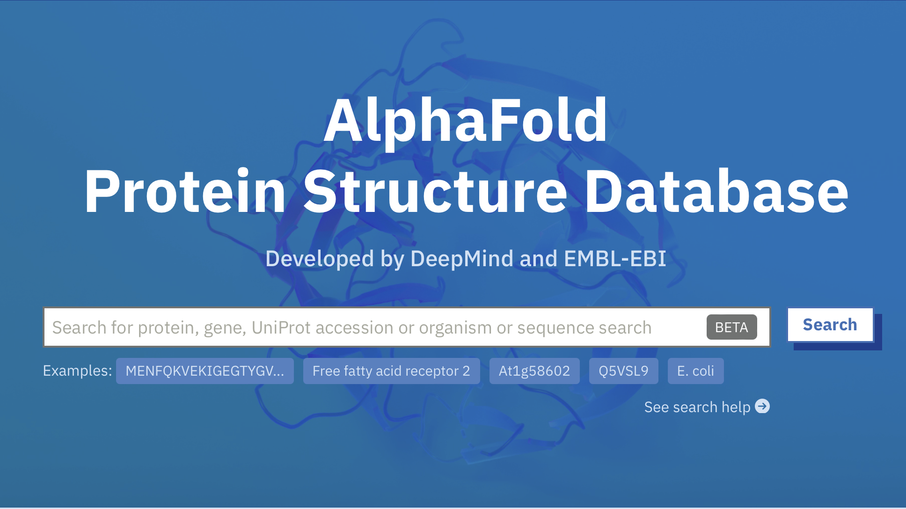

[TOC]

# Model

## A dynamic coculture model based on mechanistic coupling of genome scale metabolic models

To understand, predict and ultimately control the behavior of the synthetic microbial consortium, we designed a mechanistic, dynamic model of the microbial consortium. The balance of concentration of extracellular substrates and/or products of our microbial consortium are described by a system of ordinary differential equations (ODEs), and intracellular processes are modeled using genome scale metabolic models (GSMs) that contain all metabolic capabilities of each organism. The final model integra tes 2000 metabolites and 2442 reactions representing a broad range of processes (growth of each microorganism, metabolite production and utilization, transport between compartments, diffusion, etc). This model can be written by [SBML](https://sbml.org/) and utilized by [cobra](https://cobrapy.readthedocs.io/en/latest/#) in [python](https://www.python.org). Our model are based on the model developed by [*Toulouse INSA-UPS*](https://2021.igem.org/Team:Toulouse_INSA-UPS/Model).

### Representation of the model

Figure 1: Representation of the dynamic coculture model.

### Construction of the system of ODEs

In this section, we describe the structure of the model, the rate laws used to represent each reaction, and the balance equations for each component of the system. Model units are litre (L) for volumes, hour (hr) for time, and millimole (mmol) and gram dry weight (gDW) for amounts of metabolites and biomass, respectively.

#### Growth

$The~growth~of~each ~of~the~microorganisms~is~modeled~using~their~growth~rate~\mu(in~h^{-1})$
$$
\frac{dX_{cyano}}{dt}=X_{cyano}\cdot\mu_{cyano}
$$

$$
\frac{dX_{yeast}}{dt}=X_{yeast}\cdot\mu_{yeast}
$$

Where $X_{cyano}$ and $X_{yeast}$​ denote the biomass concentration for cyanobacteria and yeasts, respectively.

#### $CO_2$ gas transfer

The $CO_2$ balance can be represented by considering three processes: the input of $CO_2$ in the reactor provided by the bubbling of $CO_2$-enriched air ($I_{CO_2}$), the transfer of $CO_2$ from the gas to the liquid phase ($T_{CO_2}$) and finally the output of gas $CO_2$ outside of the reactors ($O_{CO_2}$) (Figure 1).
$$
\frac{d_{CO_2,g}}{dt}=I_{CO_2}-T_{CO_2}-O_{CO_2}
$$

$$
I_{CO_2}=Q_{gas}\cdot CO_{2,input}
$$

$$
T_{CO_2}=\kappa_l\alpha(\beta\cdot CO_{2,g}-CO_{2,l})
$$

$$
O_{CO_2}=Q_{gas}\cdot CO_{2,g}
$$

Where $CO_{2,g}$and $CO_{2,l}$ are the $CO_{2}$ concentrations in the gas and liquid phase respectively (in mM),$Q_{gas}$ is the flow of air bubbled in the reactor (in L.h-1), κlα is the global mass transfer coefficient of $CO_{2}$ (in h-1) and β is Henry’s law constant which models the gas-liquid equilibrium

#### Carbon source uptake

In our co-culture system, cyano utilize $CO_2$ as carbon source while yeast utilize sucrose as carbon source
$$
q_{CO_2,cyano}=q_{CO_2,cyano}^{max}\cdot(\frac{CO_{2,l}}{K_{CO_2}+CO_{2,l}})
$$

$$
q_{sucrose,yeast}=q_{sucrose,yeast}^{max}\cdot(\frac{Sucrose}{K_{Sucrose}+Sucrose})
$$

$$
\frac{d_{CO_2}}{dt}=T_{CO_2}-q_{CO_2,cyano}\cdot X_{cyano}+q_{CO_2,yeast}\cdot X_{yeast}
$$

$$
\frac{d_{Sucrose}}{dt}=q_{sucrose,cyano}\cdot X_{cyano}-q_{sucrose,yeast}\cdot X_{yeast}
$$

#### Light

Light is an important aspect of our model. First, we converted the experimentally measured light intensity $I_{light}$ ($\mu moles_{photon}\cdot m^{-2}\cdot s^{-1}$) into a specific flux $q_{photon}$($mmol_{photon}\cdot g_{DCW}^{-1}\cdot h^{-1}$)  using the reaction rate proposed by Clark et al.[1]: 
$$
q_{photon}=I_{light}\cdot \frac{3600\cdot Surface}{1000\cdot X_{cyano}\cdot Volume_{reactor}}
$$

#### Caffeic acid cycle

Each step of the caffeic cycle can be regarded as a first order reaction
$$
\frac{d[caffeic~acid]}{dt}=q_{caffeic ~acdi}\cdot X_{yeast}-K_1\cdot [caffeic ~acid]+K_5\cdot [Caffeylpyruvic~acid]
$$

$$
\frac{d[caffeoyl~CoA]}{dt}=K_1\cdot [caffeic~acid]
$$

$$
\frac{d[hispidin]}{dt}=K_2\cdot [caffeoyl~CoA]
$$

$$
\frac{d[3-Hydroxy-hispidin]}{dt}=K_3\cdot [hispidin]
$$

$$
\frac{d[Caffeyl-pyruvic~acid]}{dt}=K_4\cdot [3-Hydroxy-hispidin]
$$

where $q_{caffeic~acid}(mmol\cdot g_{DW}^{-1}\cdot h^{-1})$​ represents the production rate of caffeic acid of interest.

#### Genome Scale Models

Flux Balance Analysis (FBA), a key method for simulating metabolic fluxes in silico, represents intracellular dynamics in our model using genome scale metabolic models (GSMs) [2]. FBA employs the GSM, which encompasses the metabolic network reconstruction, to forecast phenotypic responses under environmental constraints. In the equations mentioned, various fluxes, including growth rates and specific fluxes of odorant molecule production, are described, impacting the entire production process.

Our model of *S.cerevisiae* is based on the GSM iMM904 developed by Monica L Mo et al. in 2009 [3]. iMM904 is a basic model in yeast, containing 1226 metabolites and 1577 reactions. And for the S.elongatus, we chose model  iJB785 developed by Jared T Broddrick et al. in 2016 [4]. This model contains 768 metabolites and 849 reactions. We further added 6 metabolites and 16 reactions to complete the system. 

Figure 2: Escher map of model iMM904 from [BIGG](http://bigg.ucsd.edu/models/iMM904)

## AlphaFold2 Structure Prediction

### Introduction

AlphaFold2 is an artificial intelligence software developed by DeepMind to predict the 3D structure of proteins. AlphaFold2 predicts with high enough accuracy to approximate experimental measurements. This power depends on a large enough database and a well-developed deep learning model. Specifically, it analyzes amino acid interactions and predicts how proteins are likely to fold through a technique called graph neural networks. By extracting and pairing feature information from protein-level structures, a deep learning model called “Transformer” is used to understand and interpret patterns in amino acid sequences and translate these structures into the 3D structure of the protein. Finally, optimization is performed to match the predicted pairs and distances [5].

Figure 3: Homepage of AlphaFold.

### Design

In our experiments, we used [AlphaFold2](https://colab.research.google.com/github/sokrypton/ColabFold/blob/main/AlphaFold2.ipynb?pli=1#scrollTo=kOblAo-xetgx) colab to design a fusion protein we needed. According to our previous research, we need to fuse protein TUP1(Figure 4) and protein FHY1(Figure 5) together. What’s more these two proteins should function themselves respectively. Protein TUP1 needs its N-terminal sequences to function normally [6]. When we simply put the sequences together, we found that TUP1 positioned through FHY1. And that wasn’t what we need as we proposed that mixing structure of two proteins will cause functional loss. So we decided to choose a proper linker to link two proteins as well as separate them into two clear part in space. 

Figure 4: 3D structure of TUP1

Figure 5: 3D structure of FHY1

We used some linkers that were often used in design of a fusion protein. We proposed that flexible linker wouldn’t help us divide the proteins into two clear part, so we choose rigid linkers primarily, such as (EAAAK)n, PAPAP,A(EAAAK)4ALEA(EAAAK)4 A.

## Reference

[1] R.L. Clark, L.L. McGinley, H.M. Purdy, T.C. Korosh, J.L. Reed, T.W. Root, B.F. Pfleger, Light-optimized growth of cyanobacterial cultures: growth phases and productivity of biomass and secreted molecules in light-limited batch growth, Metabolic engineering, 47 (2018) 230-242.

[2] H.S. Choi, S.Y. Lee, T.Y. Kim, H.M. Woo, In silico identification of gene amplification targets for improvement of lycopene production, Applied and environmental microbiology, 76 (2010) 3097-3105.

[3] M.L. Mo, B.Ø. Palsson, M.J. Herrgård, Connecting extracellular metabolomic measurements to intracellular flux states in yeast, BMC systems biology, 3 (2009) 1-17.

[4] J.T. Broddrick, B.E. Rubin, D.G. Welkie, N. Du, N. Mih, S. Diamond, J.J. Lee, S.S. Golden, B.O. Palsson, Unique attributes of cyanobacterial metabolism revealed by improved genome-scale metabolic modeling and essential gene analysis, Proceedings of the National Academy of Sciences, 113 (2016) E8344-E8353.

[5] J. Jumper, R. Evans, A. Pritzel, T. Green, M. Figurnov, O. Ronneberger, K. Tunyasuvunakool, R. Bates, A. Žídek, A. Potapenko, Highly accurate protein structure prediction with AlphaFold, Nature, 596 (2021) 583-589.

[6] D. Tzamarias, K. Struhl, Functional dissection of the yeast Cyc8–Tupl transcriptional co-repressor complex, Nature, 369 (1994) 758-761.

# Results

Unfortunately, due to our poor knowledge on SBML and cobrapy package, it seems too difficult for us to rebuild our own model. But there does have something we can do. 

## Carbon accounting

Based on the similar module developed by [*Toulouse INSA-UPS*](https://2021.igem.org/Team:Toulouse_INSA-UPS/Model). To better run the simulation, the difference of day and night are blurred. Supposed that the $CO_2$ situation are nearly the same for there system and ours, since we share the similar co-culturing system. It is notable that they put this bio-manufacturing system under light all day-long while we utilize this system as street lighting, so the carbon intake should be half. We run the simulation and get the results as followed. Click [here](./co-culture-simulation/code.zip) to get the code.

Figure 1: Carbon accounting results.

The result shows that the co-culture system can release the carbon burden to a certain extent. But completely carbon neutral can be achieved only if cyano get light all day. 

To go further, we will compare CYSL with traditional LED light. Suppose the size of light is $0.3\times 0.3\times 0.1=0.009m^3$.

It can be easily figured out that the carbon cost for CYSL in a day  $\approx 0.009\times(0.2-0.1)\times 10^6\times 0.044=39.6kg$. Suppose the  average power of traditional street lighting is 150w for 10h, and one kilowatt hour require 1.5kg $CO_2$. So the carbon cost of traditional street lighting in a day is 2.25kg.

Although at present CYSL seem to be too weak to substitute traditional street lighting, it is notable that when cyano recieve light all day long, the carbon release of CYSL is near zero. And our system itself is actually giving out light in dark! With more editing carried out in CYSL, we believe it holds great potential to achieve better carbon efficiency. 

## Fusion protein design

We designed 12 different linkers and expect to find a best one. However, it seemed difficult to use a linker loop to change the direction TUP1 positioned. Fortunately, one of our design showed almost complete separation of 5 models AlphaFold2 had displayed (Figure 6). 

We will show TUP1, FHY1, simply fused version as well as the best prediction below. Other designs will be attached as files. It must be noticed that the pLDDT number of our model were around 59, with our best predicted design had the higher number of 62. We proposed that the flexibility of FHY1 caused the lower number of pLDDT.

Figure 2: TUP1-FHY1

Figure 3: Five predictions of TUP1- A(EAAAK)4ALEA(EAAAK)4 A -FHY1

Test10

Sequences (designed linker sequences were shown in highlight): 

TASVSNTQNKLNELLDAIRQEFLQVSQEANTYRLQNQKDYDFKMNQQLAEMQQIRNTVYELELTHRKMKDAYEEEIKHLKLGLEQRDHQIA==AEAAAKEAAAKEAAAKEAAAKALEAEAAAKEAAAKEAAAKEAAAKA==PEVEVDNNNEKPSEINSFHHMIISSSKNVLKMEEVEVSKKRKFQTDQSDELSLLPLSKHTCFANVACSENTNGNSEIDTEYSMSSYVNSTTSMECNNDIEMKEESSGSCGEDKMISFESHLDYIYGTQNLEDFSEKVIENILYLDEQEEEEEDAKGCSSNAAKFVLSSGRWTVNQDDSTLHETKKPTIDQEFEQYFSTL

