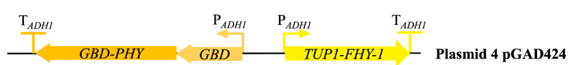

[TOC]

# Engineering

,LOV domain changes its structure and disrupt luciferase activity.Without light,LOV domain keeps tight and luciferase has catalytic activity.*

#### Test

After searching detailed information about luciferase we used,we found that its structure was still unresolved(only can be prediceted by AlphaFold).

#### Learn

Considering the difficulty of fusing LOV domain with the enzyme and achieving ideal photocontrol activity at the same time,we discarded this direction and decided to use optogenetic devices.

Figure 2. Result searched in [UniProt]( *https://www.uniprot.org/uniprotkb/A0A3G9JYH7/feature-viewer*)

### Cycle 2

#### Design&Build

When comes to optogenetic devices in yeast,there are even more choices.

Given that we need to inhibit luciferase activity in the presence of light,we can either block luciferase gene expression or express enzyme to degrade luciferase.

#### Test

After searching, we found that there were not enough studies on luciferase used in the caffeic acid cycle to find a good way to degrade it.

However,we finded that the stability of this luciferase is greatly affected by temperature, and it can naturally lose activity during the day. In the future, this property of the enzyme can be further strengthened through directed evolution and a more suitable temperature range can be found.

#### Learn

Hence,blocking luciferase gene expression is our decision.

 

### Cycle 3

During searching,we found a research which build a system to repress gene expression on the basis of yeast two-hybrid system[1].In this research,we learned about TUP1,a yeast general repressor protein.Combining yeast two-hybrid systems in optogenetics,we chose Y2H system with TUP1.

 ### Cycle 4

Here we comes to the last step,chosing a photosensitive element.

Comparing Phy-Y2H,CRY2-Y2H and LOV-Y2H in a review article[2],Phy-Y2H has the following advantages:

1) Phy-Y2H has the fastest response
2) Red light is more penetrating than blue light and works better in covered areas

### Cycle 5

When designing plasmid，we found that without GAD，GAL1 promoter won't work.So we changed our plasmid used in light-controlled switch,adding GAD gene and choosing pGAD424 plasmid,which is commercial.

After going through the above process,we decided to use a new R/FR light-controlled gene switch to design our system.

Figure 3. Plasmid and parts used in light-controlled switch

## Fusion protein TUP1-FHY1

### Cycle1

#### Design

The functional site of TUP1 is its N-terminal sequences. So FHY1 should be fused to the C-terminal of TUP1. To create the fusion protein TUP1-FHY1, we first try to simply link them together to see whether two proteins can fold normally respectively.

#### Build

We found the sequences of TUP1 and FHY1 from NCBI and previous parts from igem. Then we applied the sequences to AlphaFold2.

#### Test

We got the 3D structure of our fusion protein and the pLDDT number.

#### Learn

We found that TUP1 positioned through FHY1. And that wasn’t what we need as we proposed that mixing structure of two proteins will cause functional loss. So we decided to add a linker.

By consulting information online, we know that some specific sequences were often used. The most often used sequences such as (GGGGS)n, (ESSSK)n. We proposed that flexible linker wouldn’t help us divide the proteins into two clear part, so we choose rigid linkers primarily. 

### Cycle 2

#### Design

By consulting information online, we know that some specific sequences were often used. The most often used sequences such as (GGGGS)n, (ESSSK)n. We proposed that flexible linker wouldn’t help us divide the proteins into two clear part, so we choose rigid linkers primarily.

#### Build

|            | **Linker**                                                   |
| ---------- | ------------------------------------------------------------ |
| **Test1**  | AEAAAKEAAAKA                                                 |
| **Test2**  | AEAAAKGGGGSEAAAKA                                            |
| **Test3**  | AEAAAKEAAAKEAAAKEAAAKEAAAKEAAAKGGGGSGGGGSGGGGSEAAAKEAAAKEAAAKEAAAKEAAAKEAAAKA |
| **Test4**  | AEAAAKEAAAKEAAAKGGGGSGGGGSGGGGSEAAAKEAAAKEAAAKA              |
| **Test5**  | GGGGSEAAAKEAAAKEAAAKGGGGSEAAAKEAAAKEAAAKA                    |
| **Test6**  | AEAAAKEAAAKAAEAAAKEAAAKAAEAAAKEAAAKA                         |
| **Test7**  | PAPAP                                                        |
| **Test8**  | AEAAAKEAAAKEAAAKEAAAKALEAEAAAKEAAAKEAAAKEAAAKA               |
| **Test9**  | AEAAAKEAAAKEAAAKEAAAKEAAAKEAAAKA                             |
| **Test10** | AEAAAKECAAAKEAAAKGGGGSGCCGSGGGGSEAAAKEAAACKEAAAKA            |
| **Test11** | AEAAAKECAAAKEAAAKGGGGSGGSGGGGSEAAAKEAAACKEAAAKA              |
| **Test12** | ACEAAAKEAAAKEAAAKEAAAKALEAEAAAKEAAAKEAAAKEAAAKCA             |
| **Test13** | GGGGSGGGGSGGGGGSGGGGSGGGSGGGGS                               |

#### Test

Every time we applied the sequences to AlphaFold 2, it would give us 5 predicted models.

We designed 12 different linkers and expect to find a best one(Test13 was a simple verification that showed flexible linker had less promising results than rigid linker) . However, it seemed difficult to use a linker loop to change the direction TUP1 positioned. Fortunately, one of our designs showed almost complete separation of all 5 models AlphaFold2 had displayed.

#### Learn

We found that linkers with (GGGGS) showed less expected results when testing. And a longer linker showed better results. The inserting of amino acid C had no positive effects on the results. 

Also, it must be noticed that the pLDDT number of our model were around 59, with our best predicted design had the higher number of 62. We proposed that the flexibility of FHY1 caused the lower number of pLDDT.

We at last choose Test 8 as our final model. 

## Construction of Luminescence Circuit and Biosynthesis of Caffeic Acid

### Cycle 1

#### Design 

As the substrates of the fungal bioluminescence pathway can be recycled, we initially planned to secrete a large amount of enzyme and caffeic acid into the extracellular space, so that the enzyme and substrate could accumulate to high concentrations outside the cell to achieve higher luminous intensity, which was proved in a paper. [3] At the same time, we can control the transport pathway of small molecules such as NADPH and ATP on the cell membrane to control light emission.

#### Build 

We planned to link the enzymes which involved in the recycling process with signal peptides and then introduce them into S. cerevisiae, along with the necessary transport proteins. We initially intended to construct three plasmids for this part, each responsible for the production of caffeic acid, the secretion of enzymes which involved in the recycling process, and the synthesis of transport proteins.

#### Test 

Limited by time condition, we cannot test our device in the lab. However, we have found some serious problems.

#### Learn 

Because the circuit can turn Malonyl-CoA to CoA and pyruvic acid, in order to recycle these substances, the number of transport proteins required was excessive and the operation was complicated. [4] What’s more, high-energy substances like NADPH are easy to generate free radicals under oxidizing conditions outside, which could damage the enzymes. So, we abandoned this approach and decided to place the luminescence cycle into the cells.

### Cycle 2

#### Design  

Through reading papers, we learned that the key enzyme Luz literature research, has poor thermal stability and loses activity within 10 minutes above 30 degrees, while the higher temperature exists during the day. Therefore, we designed to control the synthesis of the Luz enzyme as a key to control light emission.

#### Build

Because the light control device cannot work without GAL1 promoter, we planned to construct three plasmids for this part: one mainly for the production of caffeic acid, another for the synthesis of enzymes used in the cycle, and genes on these two plasmids are expressed continuously to replenish enzymes which is degraded or lose activity. The third plasmid would express Luz as the part to control luminescence.

#### Test 

Limited by time condition, we cannot test our device in the lab.

#### Learn 

Including the light control device, the number of plasmids which need to be introduced is 4, which is difficult to seek for the target strains and makes the procedure quite complex. We are about to conclude this DBTL cycle and propose possible improvement plans.

Clone more genes to a plasmid? But plasmids which are too long is easy to be broken?

Use other fungi such as Rhodotorula toruloides which can synthesis TAL itself? [5]

[1] M. Hirst, C. Ho, L. Sabourin, M. Rudnicki, L. Penn, I. Sadowski, A two-hybrid system for transactivator bait proteins, Proceedings of the National Academy of Sciences, 98 (2001) 8726-8731.

[2] M.D. Hoffmann, F. Bubeck, R. Eils, D. Niopek, Controlling Cells with Light and LOV, Advanced Biosystems, 2 (2018) 1800098.

[3] P. Zheng, J. Ge, J. Ji, J. Zhong, H. Chen, D. Luo, W. Li, B. Bi, Y. Ma, W. Tong, Metabolic engineering and mechanical investigation of enhanced plant autoluminescence, Plant Biotechnology Journal, (2023).

[4] A.A. Kotlobay, K.S. Sarkisyan, Y.A. Mokrushina, M. Marcet-Houben, E.O. Serebrovskaya, N.M. Markina, L. Gonzalez Somermeyer, A.Y. Gorokhovatsky, A. Vvedensky, K.V. Purtov, Genetically encodable bioluminescent system from fungi, Proceedings of the National Academy of Sciences, 115 (2018) 12728-12732.

[5] Y. Li, J. Mao, Q. Liu, X. Song, Y. Wu, M. Cai, H. Xu, M. Qiao, De novo biosynthesis of caffeic acid from glucose by engineered Saccharomyces cerevisiae, ACS Synthetic Biology, 9 (2020) 756-765.