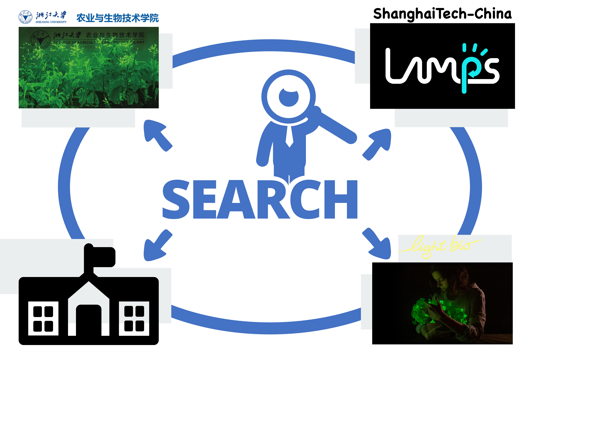
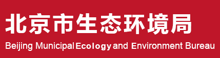
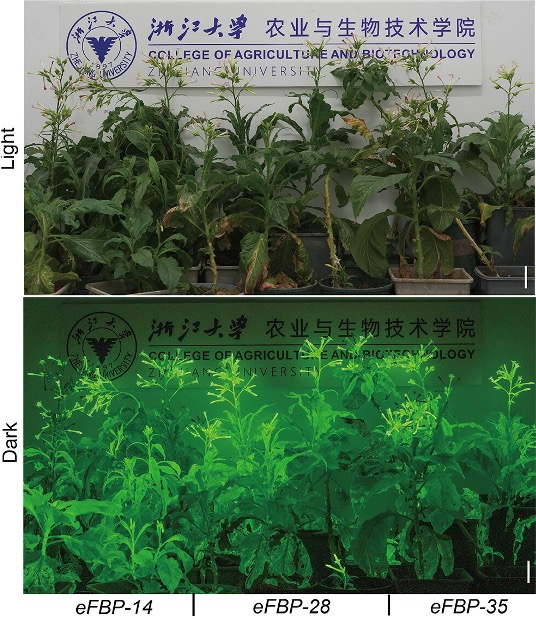
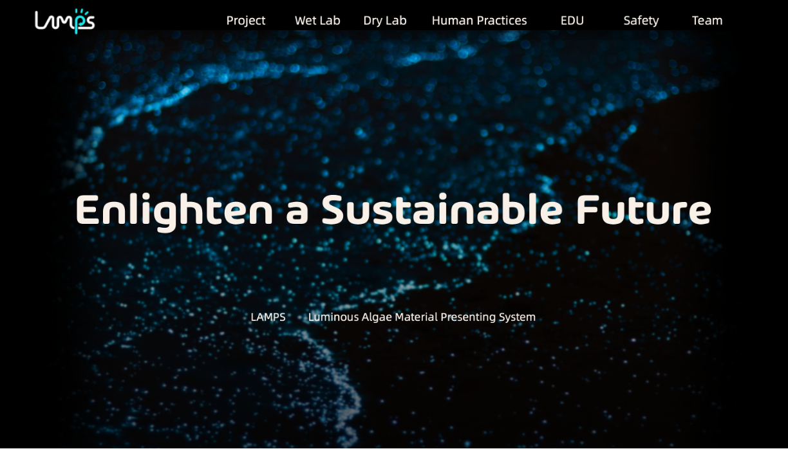
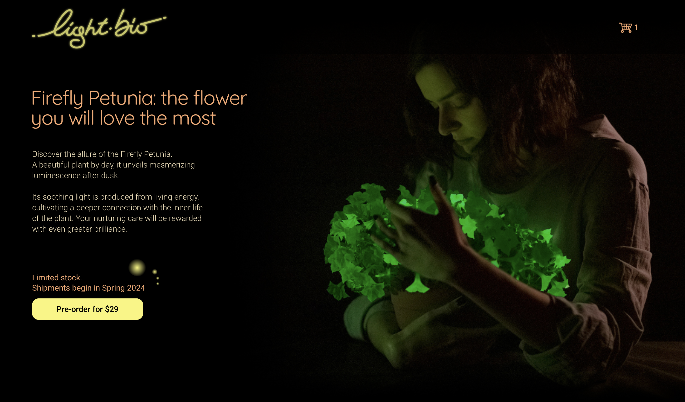

[TOC]

# Human Practice

We aim to create something that is both environmental-friendly and multi-functional. The bio-street lighting should not only be able to light up the night but also light up the people's mind of environmental conservation. So the human practice were designed to better understand current situation of energy structure, bio-luminescence system, commercial potential of carbon-free light system and how to influence the next generation.

## Integrated Human Practice

### Overview

Great physicist Newtown once said, "*If I have seen further it is by standing on ye shoulder of Giants.*" As a young team eager to do something, we'll definitely go further with the aid of predecessor. In the integrated human practice, we mainly focus on the communication with different research groups and relevant organizations (Figure 1).

Figure 1: Representation of the integrated human practice. 

### Government

China is one of the brightest countries in night. Our city Beijing, also the capital of China, has been increasingly recognized for its efforts in environmental protection and sustainability. Over the past few years, the city has undertaken significant measures to combat pollution and promote green living. 

In 2016, Beijing government released relevant document to instruct the [green light project](https://fgw.beijing.gov.cn/gzdt/tztg/202004/t20200417_1818685.htm). It is estimated that the use of intelligent LED lighting products can save 80% of electricity. Promote 2 million (sets) of intelligent LED lighting products, which can save 200 million kilowatt-hours of electricity per year, save 220 million yuan of electricity, and reduce 170,000 tons of carbon dioxide[1]. Thus it can be seen that our bio-luminescence system holds great potential for energy saving and carbon neutralizing.

Figure 2: What the [Earth](https://earthobservatory.nasa.gov/) looks like at night on 2022 February 13. By [NASA](https://apod.nasa.gov/apod/ap220213.html)

We planned to have a conversation with Beijing municipal ecology and environment bureau. The conversation should be focus on present energy structure and street lighting situation of Beijing, how does the green light project move forward and what should be take care of  from the perspective of policy makers. 

### Du hao team

Du hao team from college of agriculture and biotechnology of Zhejiang university has been keen on the engineering of plants. In 2023, they proposed a new strategy to transplant the caffeic acid cycle into plants and succesfully improved the brightness of luminous plant [2].

Since they chose the same bio-luminescence system, we can learn from how they transplant the caffeic acid cycle and how they improved it. Compared to our microbial carrier, they chose plants to load the bio-luminescence cycle. It should be interesting and meaningful to compare the two different choices and help us to further design our model. 

Figure 3: The performance of *eFBP* bioluminescent plants in lighting up the room, picture captured with a Nikon D750 camera with the above parameter. Scale bars, 10 cm. From  *Metabolic engineering and mechanical investigation of enhanced plant autoluminescence* [2].

### ShanghaiTech-China 2023

It's suprising to find that another team ShanghaiTech-China from ShanghaiTech university competed for iGEM in 2023 with the similar project of ours. Instead of caffeic acid cycle, they select a bacterial-original luminescence system to create light. 

They transfered the luxCDABE operon gene into PCC7942 strain(a kind of cyano) to produce carbon-free light. We also compared the co-culture system and cyano-single system and finally decided our present design due to the higher production ability and engineering potential. It should be beneficial to have a communication with them.

Figure 4: [Homepage](https://2023.igem.wiki/shanghaitech-china/index.html) of LAMPS by ShanghaiTech-China 2023.

### Light bio

To make the design more suitable for the society and can be really implemented into our life, this project should be profitable and possess marketing potential. One of the successful cases is light bio, a commercial company celling firefly petunia. They have just released their product reservation and gained received a great deal of attention. 

It's interesting to learn how they come up with the idea and how to make it profitable. Selling a living plant is different from selling an iphone, especially for genetically engineered plants. How to make the light sustainable is also a key question we care about. 

Figure 5: [Homepage](https://light.bio) of Light Bio.

### Reference

[1] 京发改[2016]1586号《北京市“十三五”时期绿色照明工程实施方案》

[2] Zheng, P., Ge, J., Ji, J., Zhong, J., Chen, H., Luo, D., Li, W., Bi, B., Ma, Y., Tong, W., Han, L., Ma, S., Zhang, Y., Wu, J., Zhao, Y., Pan, R., Fan, P., Lu, M. and Du, H. (2023), Metabolic engineering and mechanical investigation of enhanced plant autoluminescence. Plant Biotechnol. J, 21: 1671-1681. doi: 10.1111/pbi.14068

## education

Before coming to the main content,here are two facts seemingly irrelevant:

(1) Human production uses a lot of energy and contributes to higher and higher levels of carbon dioxide on Earth.Nowadays,energy and environment are two of the biggest concerns.

(2) Nearly 200 years ago,the world's first electric lamp was lit.Since then, people can get the light wherever wire exists.Nowadays,most electric lights still rely on wires.

With the help of synthetic biology,both of these problems can probably be solved, and our world will be a better place.

What we do is trying to increase public engagement and let people of all ages and all walks of life realize the needs of our world and feel the charm and potential of synthetic biology!

### Outline

 

Figure6: Three progressive goals during our education

### Prepare tools needed for for education and communication

(1) a poster to introduction to synthetic biology and our projects

*(2)* fairy tale books drawing about a story of *The Prince of Cyanobacteria and the Princess of Yeast defeat the carbon dioxide monster to reclaim the light for the people*

(3)a slide introducing basic knowledge of synthetic biology,which can be easily understood by junior high school students.

(4)Brochures corresponds to our project,emphasizing the environmental and energy value of the project

### Strive for our goals

#### Education and publicity

At this stage,we are trying to educate the general public about our project and synthetic biology.Tools we use for this stage are posters,fairy tale books and brochures.

We need to **combine both online and offline forms** and use the power of online media to expand our influence.

Online form : Use online articles, videos, and live broadcasts on all platforms

Offline form : Promote our programs and synthetic biology in parks,kindergartens and other places.

#### Perception and inspiration

At this stage,our goal is to inspire middle school students who are just beginning to learn about biology and other sciences to feel the charm and inspiration of synthetic biology.

We mainly introduce synthetic biology and our project to middle school students and some primary school students in the form of **volunteer teaching and micro-class.**

#### Trust and expectation

At this stage, we will no longer focus on different people, but focus on the significance of our projects to solve environmental, energy and other issues, and further let the whole society realize the power of synthetic biology to solve current problems and build a better world, so that they can trust and look forward to synthetic biology.