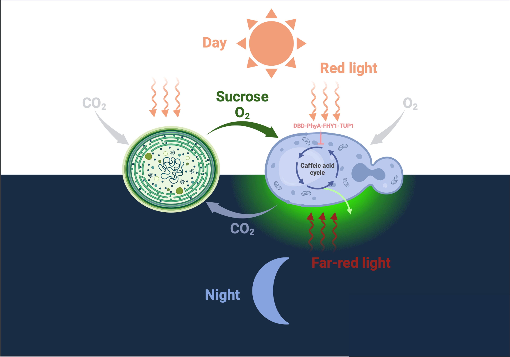
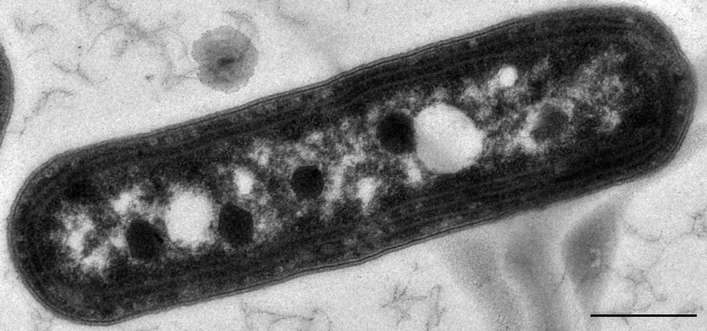
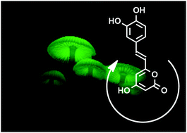
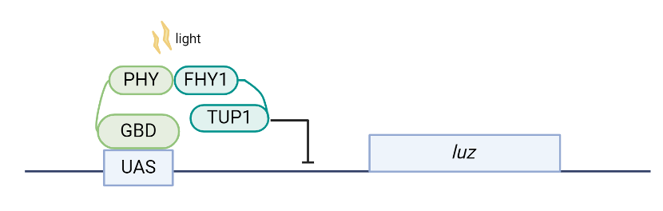

# Project description

## Overview

Figure 1: Representation of CYSL

Our project was designed to achieve:

- Stay resting during the daytime
  - The DBD-PhyA-FHY1-TUP1 system recognize daytime by red light and thus be activated to suppress the expression of Luz, leading to the block of caffeic cycle and no light emission.
- Emission light at night
  - The DBD-PhyA-FHY1-TUP1 system should be suppressed under far-red light, which is the main role of night. The caffeic acid cycle is thus activated to produce green luminescence.
- Reduce the carbon burden
  - Cyano is  autotrophic organism and could utilize $CO_2$ as carbon resource. We designed the co-culture system to feed yeast by cyano thus achieve green cabon source for yeast.

## Design principle

Environmentally friendly: Our project should be sustainable and reliable, hopeful to help create better environment, performing better in carbon acounting.

Efficiency: To make it really come into our life, our project should reveal good efficiency compared with traditional street lighting. It should be at least as functional as the traditional light. Able to automatically switch the light and the light intensity should meet the needs of resident.

Profitable: Cost is a pivotal factor in bio-engineering. Only when the project is profitable can it attracts more companies to invest in it. Street lighting is rooted everywhere in everybody's life, so there is a giant market for better street lighting strategies. Our project should possess commercial potential to go further. 

## System and technology

### Synechococcus elongatus

Figure 2: Electron micrograph of *Synechococcus elongatus* PCC 7942 cell showing the carboxysomes as polyhedral dark structures. From [wikipedia](https://en.wikipedia.org/wiki/Synechococcus_elongatus).

Inspired by the project Team INSA-UPS had done in 2021 iGEM Competition, we tried to build a co-culture system to achieve sustainable luminescence with just the energy from sunlight. Moreover, this system can also catch CO2 from atmosphere. We hope our co-culture system could achieve at least one month automatically sustain the luminescence system to enhance the practicality when we make our whole project into real street lamps.

Cyanobacteria are photoautotrophic organisms that are the main bearers of oxygen production by photosynthesis. Among them, *Synechococcus* *elongatus* (*S. elongatus*), with its simple structure, rich genetic diversity and ecotypes, is a model species for microbial ecology research. Moreover, the genome information was published earlier, with a mature genetic transformation system, and the background information in physiology, biochemistry and molecular biology is clearer, which is a dominant species among the model species of cyanobacteria, and it can be used as a good material for the research of molecular mechanism of algal inhibition by chemosensory substances. 

Furthermore, *S.elongatus* is a widely used model for co-culture system. It can produce and release sucrose under salt stress, providing carbon source for another microorganism.

### Saccharomyces cerevisiae

Figure 3: Scanning electron micrograph of *Saccharomyces cerevisiae*.

*Saccharomyces cerevisiae* (*S.cereviasiae*), or brewer's yeast, is a cornerstone in synthetic biology due to its simple eukaryotic structure, well-mapped genome, and advanced genetic modification capabilities. These features make it an ideal model for genetic studies and bioengineering. Its ability to produce a variety of valuable compounds and its established safety record in food and beverage industries further solidify its role as a versatile and reliable organism for both research and industrial biotechnology applications.

### Fungal bioluminescence pathway

The fungal bioluminescence pathway (FBP) (Figure 4) is a circuit which depends on four key enzymes from *N. nambi* (Luz H3H HispS CPH). Substrate of the circuit is caffeic acid. Introducing this caffeic acid cycle into *S.cerevisiae* should enable it to be luminous. 

Figure 4: *Neonothopanus nambi* giving out green light by caffeic acid cycle. From *Identification of hispidin as a bioluminescent active compound and its recycling biosynthesis in the luminous fungal fruiting body* [1].

### Optogenetic system

To minimize energy waste and guarantee nocturnal luminescence, given the energy-intensive nature of the luminescence process, we selected a light-responsive gene promoter system. Following a comparison of various systems, the R/FR light-controlled gene switch was chosen for our design. This system ensures that the luz gene is inhibited during bright conditions or daytime by the activation of PhyA, preventing luminescence. Conversely, in darkness or the absence of red light, Pfr converts to its inactive form, Pr, enabling the system to glow. Moreover, in shaded areas where far-red light (FR) predominates over red light (R), PhyA remains inactive due to the higher FR proportion.

Figure 5: Representation of FR-R switch. 

## Reference

[1] Y. Oba, Y. Suzuki, G.N. Martins, R.P. Carvalho, T.A. Pereira, H.E. Waldenmaier, S. Kanie, M. Naito, A.G. Oliveira, F.A. Dörr, Identification of hispidin as a bioluminescent active compound and its recycling biosynthesis in the luminous fungal fruiting body, Photochemical & Photobiological Sciences, 16 (2017) 1435-1440.

