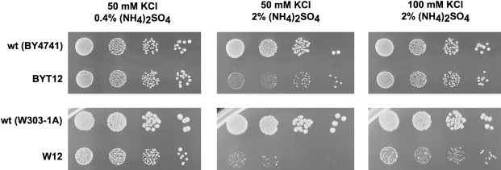
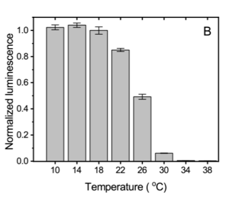
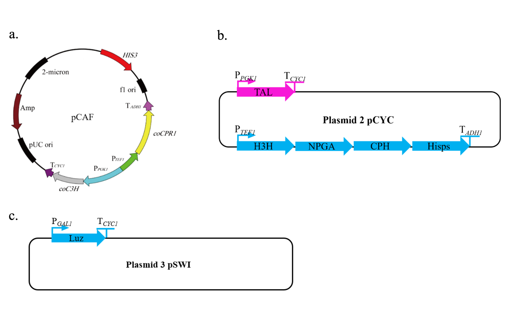
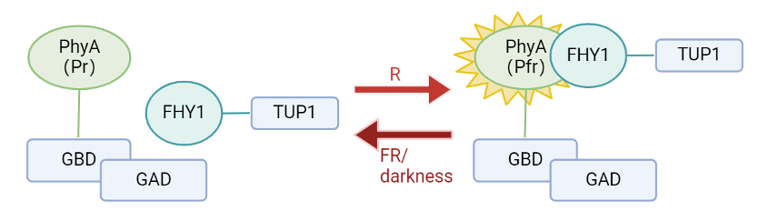

[TOC]

# Design

## Co-culture

Inspired by the project Team INSA-UPS had done in 2021 iGEM Competition, we tried to build a co-culture system to achieve sustainable luminescence with just the energy from sunlight. Moreover, this system can also catch CO2 from atmosphere. We hope our co-culture system could achieve at least one month automatically sustain the luminescence system to enhance the practicality when we make our whole project into real street lamps.

Thus, we chose cyanobacteria and yeast as the strains in the co-culture system. Strain *S. elongatus UTEX 2973 CscB+* can absorb CO2 and transform it to sucrose as well as transport sucrose out of the cell. Then Strain Saccharomyces cerevisiae W303clump, which had strong ability to use sucrose as carbon sources, will obtain sucrose from the medium and sustain the luminescence system. Therefore, there is no need to add additional carbon sources during cultivation.

### Synechococcus elongatus UTEX 2973, an attractive chassis for sustainable bioproduction

Cyanobacteria are prokaryotic organisms capable of oxygenic photosynthesis. They utilize sunlight, the most prevalent form of renewable energy, to power their metabolic activities while efficiently converting carbon dioxide (CO2) into organic carbon compounds [1, 8, 11]. These organisms have the ability to thrive in non-arable areas and can be cultivated using saltwater or wastewater, thereby avoiding competition with food production [7, 8]. In contrast to plants or eukaryotic microalgae, cyanobacteria exhibit rapid growth and are straightforward to manipulate genetically. [9, 10]. Carbon-neutral frameworks like these possess significant potential as platforms for industrial biotechnology, offering promising avenues for bioproduction.[1, 8, 9, 10, 11]. 

*Synechococcus elongatus* UTEX 2973 (hereafter *Syn UTEX 2973*), a freshwater cyanobacterium strain isolated in 2015, grows photo-autotrophically with one of the fastest rates reported for any photosynthetic microbe, with generation times as low as 1.5 hours which is equivalent to heterotrophic organisms such as certain yeasts [9, 10]. 

Nevertheless, despite the benefits of employing cyanobacteria in biotechnological applications, certain constraints have hindered their establishment as a conventional microbial platform. In comparison to model heterotrophs like E. coli or S. cerevisiae, cyanobacteria typically exhibit slower growth rates. Additionally, the repertoire of characterized genetic components and synthetic biology tools is considerably more limited [1, 8, 11]. Ultimately, numerous technical hurdles persist, particularly in realizing the scaling-up of cyanobacteria-based biotechnological processes in a financially viable manner [2, 4].

Figure 1: Electron micrographs of *Synechococcus elongatus UTEX 2973*. Labels are carboxysomes (C) and thylakoid membranes (T) (adapted from Yu et al.2015 [9])

### Strain Saccharomyces cerevisiae W303 clump, a good consumer of sucrose

Based on the work down by Hays et al.[5], we chose Saccharomyces cerevisiae W303clump as our strain. S. cerevisiae growth in co-culture is dependent on genetic engineering to improve sucrose utilization. 

Wild type (WT) S. cerevisiae W303 did not grow in co-culture with or without IPTG induction. We examined the capacity of WT S.cerevisiae W303 to grow axenically at low sucrose concentrations and saw poor/no growth below 2.5 g/L sucrose , a higher concentration of sucrose than is produced by cscB+ S. elongatus at 48 hours. 

It is notable that W303 performed far better than other strains under salt stress (Figure 2), making it more suitable for our design.

Figure 2: Saccharomyces cerevisiae BY4741 and W303-1A laboratory strains differ in salt tolerance. (adapted from Hana et al.[])

However, an engineered strain, named W303Clump, derived from previous directed evolution experiments of S. cerevisiae W303 in low sucrose media. W303Clump contains mutations in genes CSE2, IRA1, MTH1, and UBR1 that enhance fitness in dilute sucrose, and also contains a nonsense mutation in ACE2 that compromises the full septation of budding daughter cells from the mother, resulting in small clonal cell aggregates (~6.6 cells per clump on average). These clusters proliferate in environments with low sucrose concentrations, facilitated by heightened local cell density and enhanced hexose availability subsequent to the external breakdown of sucrose by invertase enzymes. . Unlike the parental strain, axenic cultures of W303Clump exhibited some growth at all tested sucrose concentrations ≥0.156 g/L, as well as when co-cultured with IPTG-induced cscB+ S. elongatus. 

### Sucrose secretion & Coculture with S. cerevisiae

Industrial biotechnology offers alternative solutions to lessen reliance on fossil fuels. Present biotechnological methods involving heterotrophic organisms depend on sugar inputs derived from agriculture, frequently entering into competition with the food and feed markets. Consequently, the expense of the carbon source in commercial fermentations constitutes a significant portion, accounting for up to 50% of the overall operating cost [6,12]. The choice of sugar feedstock therefore remains a challenge to achieve a sustainable and cost-effective bioproduction [4,6].

Many cyanobacterial species are known to accumulate sucrose to resist osmotic stress. Several strain engineering studies have been carried out in the last few years to further enhance the sucrose production in *Synechococcus* [4, 6]. In particular, the sucrose/H+ symporter CscB, from *E. coli*, was recently introduced in UTEX 2973 under the control of the IPTG-inducible promoter PlacUV5 leading to sucrose production with a rate of 1.9 g.L−1.day−1 in salt stress conditions, reaching titers as high as 8 g.L−1 [4]. 

Figure 3: Engineering sucrose secretion in *Syn UTEX 2973* (adapted from Lin et al.2020 [4]) A) Metablolic pathway for sucrose secretion in *Syn UTEX 2973* B) Genetic construction inserted in the genome of the cscB strains developed by Lin et al. 2020 which secrete sucrose upon salt stress and IPTG induction [4]. The additional overexpression of the spp and sps genes allows sucrose production without need of salt stress.

The recovery of sugars from the culture media being expensive and inefficient, an alternative strategy is to develop a “one pot” synthetic microbial consortium between the sucrose secreting cyanobacteria and another heterotrophic organism [5]. This modular approach has been successfully applied for many organisms, including *E. coli*, *B. subtilis*, *P. putida* as well as various yeast species [3,5]. 

## The Bioluminescence System

### Fungal bioluminescence pathway

Bioluminescence is a natural phenomenon which was observed in bacteria, fireflies and fungi. However, although luciferin and luciferase in fireflies are wildly used in identification, the pathway to regenerate luciferin has not been clearly characterized (figure 4)[13]. The fungal bioluminescence pathway (FBP) (Figure 5) is a circuit which depends on four key enzymes from *N. nambi* (Luz H3H HispS CPH). Substrate of the circuit is caffeic acid. Research shows that fungi which is introduced the four enzymes and caffeic biosynthesis pathway can luminous as well [14].What’s more, NPGA from *A. nidulans* can combine with Hisps and speed up the whole cycle [15].

Figure 4: The part in the block has not been characterized [13].

Figure 5 The circuit of caffeic acid [15].

The Luciferase from fungi is not stable above 30 degrees (Figure 6)[14]. During the day, the Luciferase will become inactive and the circuit will be blocked. During the night, as the Luciferase began to be produced, the circuit will recover and luminous. 

Figure 6: Total light emission after 10min incubation of recombinant purified Luz at various temperatures [14]

### S.cerevisiae modification

*S. cerevisiae* can synthesis tyrosine. Previous research shows that TAL from *Rhodobacter capsulatus* (RcTAL) could catalyze the deamination of l-tyrosine and led to the biosynthesis of p-coumaric acid in *S. cerevisiae*. C3H from *A. thaliana* could catalyze the hydroxylation of p-coumaric and led to the biosynthesis of caffeic acid. (Figure 7) [16]. As C3H depends on cytochrome P450 reductase (CPR), the CPR is needed to transfer electrons.

Figure 7 Caffeic acid biosynthesis pathway [18]

We partly followed the gene circuit design and plasmid design from the original paper. Three kinds of plasmids are needed, which named pCAF (Figure 8a), pCYC (Figure 8b) and pSWI(Figure 8c). pCAF is totally same as the one in the original paper. We plan to use Gibson assembly to clone 5 genes (TAL H3H CPH HispS NPGA) in a plasmid (pCYC). And the luciferase with GAL1 promoter will be placed in pSWI.

Figure 8: pCAF [14], pCYC and pSWI

## A light-controlled gene switch

Since the luminescence process is energy-consuming,to avoid energy waste and ensure it can glow at night,we chose light-responsive gene promoter system.

### Design

#### Light-controlled Phy-FHY1

Phytochromes (Phys) are plant photoreceptors that exist in two inter-convertible conformational states. Pr is the inactive form and cannot interact with FHY1 and Pfr is the active form.When absorbing far red light or being kept in darkness,Pfr(active) will turn into Pr(inactive).

Figure 9: a) *luz* can transcribe in darkness or shadow b) *luz* is repressed by TUP1 in daytime or bright environment

In the model organism Arabidopsis thaliana, a group of light-sensitive proteins known as phytochromes is represented by five related receptors, named PhyA, PhyB, PhyC, PhyD, and PhyE. Following the same molecular concepts, PhyA or PhyB along with their respective interacting partners have been utilized as synthetic light-responsive switches in yeast up to this point.

Figure 10: Conversion between Pf and Pfr

*Supplementary of (1):*

*Phytochrome receptors consist of a protein part and a covalently linked chromophore part,and the chromophore is not synthesized in yeast.Phycocyanobilin (PCB) produced by cyanobacteria is always used as analog of chromophore in yeast* [17]*. However,without the chromophore,Phy can also work in yeast though weakly* [18], *and when cyanobacteria dead,PCB can be released into medium .Hence,PCB is not paid too much attention.*

#### Phy-FHY1 pairs

Research shows that the PhyA-FHY1 pair provides higher induction level with lower background than that of the PhyB-PIF3 pair[18],hence we choose PhyA-FHY1 as our light-sensing pair.

Commonly used light-regulated gene expression system in yeast consist of PHY-GBD, IP-GAD and GAL1 promoter.On this basis, we replace GAD with TUP1 in order to achieve the effect of blocking gene expression when PhyA is activated.And to keep GAL1 promoter working,GAD is also transferred into cell.

 

#### Repressor TUP1

TUP1 is a yeast general repressor protein.The N-terminal 200 residues of TUP1 are sufficient to cause repression when artificially recruited to a promoter [19].A two-hybrid system for transactivator bait proteins has been developed using DBD-bait and TUP1-prey fusion.What’s more,TUP1 can repress gene expression even when GAD exists.[20]So GBD-PHY fusion protein ,GAD and TUP1-FHY1 fusion protein are used in our switch.

## Parts

Figure 11: Representation of our parts.

It should notable that it seems that we have put too much pressure on yeast. Maybe we can utilize the co-culture system, letting cyano share some burden. 

 

#### Working scenario

When in daytime or the environment is bright, PhyA will be activated and luz gene will be blocked ,thus our system won’t glow.

When in dark,without red light,Pfr will be degraded or slowly turn into Pr,which is inactive.Also,in the shade(where top plants absorb a lot of red light),FR has a higher proportion than R,so PhyA will also be inactive.

## Reference

[1] S. Li, T. Sun, C. Xu, L. Chen, W. Zhang, Development and optimization of genetic toolboxes for a fast-growing cyanobacterium Synechococcus elongatus UTEX 2973, Metab Eng, 48 (2018) 163-174.

[2] Y. Oba, Y. Suzuki, G.N.R. Martins, R.P. Carvalho, T.A. Pereira, H.E. Waldenmaier, S. Kanie, M. Naito, A.G. Oliveira, F.A. Dörr, E. Pinto, I.V. Yampolsky, C.V. Stevani, Identification of hispidin as a bioluminescent active compound and its recycling biosynthesis in the luminous fungal fruiting body, Photochemical & Photobiological Sciences, 16 (2017) 1435-1440.

[3] T. Li, C.T. Li, K. Butler, S.G. Hays, M.T. Guarnieri, G.A. Oyler, M.J. Betenbaugh, Mimicking lichens: incorporation of yeast strains together with sucrose-secreting cyanobacteria improves survival, growth, ROS removal, and lipid production in a stable mutualistic co-culture production platform, Biotechnol Biofuels, 10 (2017) 55.

[4] P.C. Lin, F. Zhang, H.B. Pakrasi, Enhanced production of sucrose in the fast-growing cyanobacterium Synechococcus elongatus UTEX 2973, Sci Rep, 10 (2020) 390.

[5] S.G. Hays, L.L.W. Yan, P.A. Silver, D.C. Ducat, Synthetic photosynthetic consortia define interactions leading to robustness and photoproduction, J Biol Eng, 11 (2017) 4.

[6] D.C. Ducat, J.A. Avelar-Rivas, J.C. Way, P.A. Silver, Rerouting carbon flux to enhance photosynthetic productivity, Appl Environ Microbiol, 78 (2012) 2660-2668.

[7] N.E. Nozzi, J.W. Oliver, S. Atsumi, Cyanobacteria as a Platform for Biofuel Production, Front Bioeng Biotechnol, 1 (2013) 7.

[8] M. Santos-Merino, A.K. Singh, D.C. Ducat, New Applications of Synthetic Biology Tools for Cyanobacterial Metabolic Engineering, Front Bioeng Biotechnol, 7 (2019) 33.

[9] J. Yu, M. Liberton, P.F. Cliften, R.D. Head, J.M. Jacobs, R.D. Smith, D.W. Koppenaal, J.J. Brand, H.B. Pakrasi, Synechococcus elongatus UTEX 2973, a fast growing cyanobacterial chassis for biosynthesis using light and CO(2), Sci Rep, 5 (2015) 8132.

[10] J. Ungerer, K.E. Wendt, J.I. Hendry, C.D. Maranas, H.B. Pakrasi, Comparative genomics reveals the molecular determinants of rapid growth of the cyanobacterium Synechococcus elongatus UTEX 2973, Proc Natl Acad Sci U S A, 115 (2018) E11761-E11770.

[11] F. Wang, Y. Gao, G. Yang, Recent advances in synthetic biology of cyanobacteria for improved chemicals production, Bioengineered, 11 (2020) 1208-1220.

[12] J.C. Ortiz-Marquez, M. Do Nascimento, J.P. Zehr, L. Curatti, Genetic engineering of multispecies microbial cell factories as an alternative for bioenergy production, Trends Biotechnol, 31 (2013) 521-529.

[13] Y.Y. Cheng, Y.J. Liu, Luciferin Regeneration in Firefly Bioluminescence via Proton-Transfer-Facilitated Hydrolysis, Condensation and Chiral Inversion, Chemphyschem, 20 (2019) 1719-1727.

[14] A.A. Kotlobay, K.S. Sarkisyan, Y.A. Mokrushina, M. Marcet-Houben, E.O. Serebrovskaya, N.M. Markina, L. Gonzalez Somermeyer, A.Y. Gorokhovatsky, A. Vvedensky, K.V. Purtov, V.N. Petushkov, N.S. Rodionova, T.V. Chepurnyh, L.I. Fakhranurova, E.B. Guglya, R. Ziganshin, A.S. Tsarkova, Z.M. Kaskova, V. Shender, M. Abakumov, T.O. Abakumova, I.S. Povolotskaya, F.M. Eroshkin, A.G. Zaraisky, A.S. Mishin, S.V. Dolgov, T.Y. Mitiouchkina, E.P. Kopantzev, H.E. Waldenmaier, A.G. Oliveira, Y. Oba, E. Barsova, E.A. Bogdanova, T. Gabaldon, C.V. Stevani, S. Lukyanov, I.V. Smirnov, J.I. Gitelson, F.A. Kondrashov, I.V. Yampolsky, Genetically encodable bioluminescent system from fungi, Proc Natl Acad Sci U S A, 115 (2018) 12728-12732.

[15] P. Zheng, J. Ge, J. Ji, J. Zhong, H. Chen, D. Luo, W. Li, B. Bi, Y. Ma, W. Tong, L. Han, S. Ma, Y. Zhang, J. Wu, Y. Zhao, R. Pan, P. Fan, M. Lu, H. Du, Metabolic engineering and mechanical investigation of enhanced plant autoluminescence, Plant Biotechnol J, 21 (2023) 1671-1681.

[16] Y. Li, J. Mao, Q. Liu, X. Song, Y. Wu, M. Cai, H. Xu, M. Qiao, De Novo Biosynthesis of Caffeic Acid from Glucose by Engineered Saccharomyces cerevisiae, ACS Synth Biol, 9 (2020) 756-765.

[17] L. Li, J.C. Lagarias, Phytochrome assembly in living cells of the yeast Saccharomyces cerevisiae, Proceedings of the National Academy of Sciences, 91 (1994) 12535-12539.

[18] O. Sorokina, A. Kapus, K. Terecskei, L.E. Dixon, L. Kozma-Bognar, F. Nagy, A.J. Millar, A switchable light-input, light-output system modelled and constructed in yeast, Journal of Biological Engineering, 3 (2009) 15.

[19] S.Y. Roth, Chromatin-mediated transcriptional repression in yeast, Curr Opin Genet Dev, 5 (1995) 168-173.

[20] M. Hirst, C. Ho, L. Sabourin, M. Rudnicki, L. Penn, I. Sadowski, A two-hybrid system for transactivator bait proteins, Proceedings of the National Academy of Sciences, 98 (2001) 8726-8731.

[21] S. Petrezselyova, J. Zahradka, H. Sychrova, Saccharomyces cerevisiae BY4741 and W303-1A laboratory strains differ in salt tolerance, Fungal Biology, 114 (2010) 144-150.

 