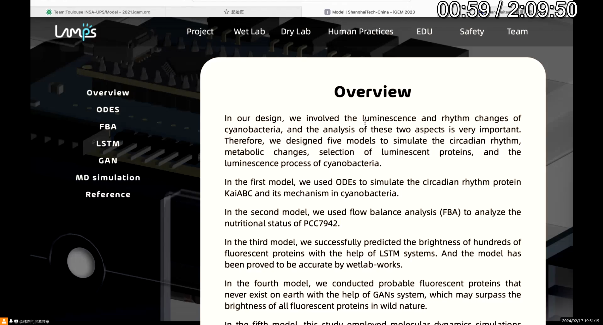
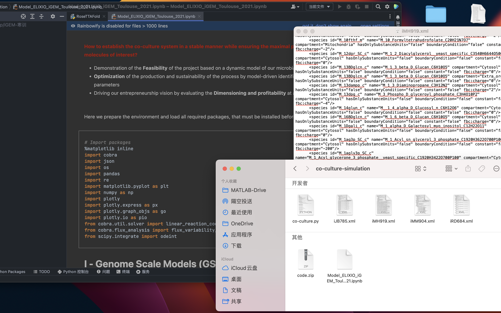
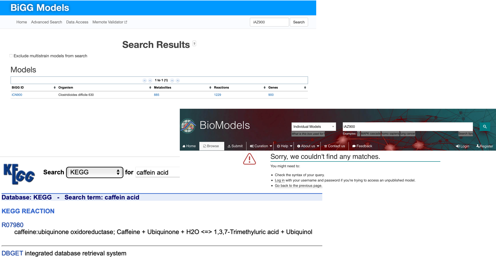

[TOC]

# Trouble shooting

As a winter vacation training project, we experienced the accumulation of knowledge in the early stage, the brainstorming in the middle stage and the presentation of the project in the late stage, in which many deficiencies appeared, which we summarized as experience and learned from it. 

## Project design

### Duplicate checking

One of our biggest mistake is that we forgot to check whether our project has been down before in iGEM. When we came up with the idea of bio-street lighting, we searched nearly all the relevant paper, patent and start-ups. However, the difficult search engine of iGEM make it hard to quickly check previous project.It was only when our teammember in charge of the wiki shared the BEST wiki project for 2023 that we suddenly realized how similar Shanghaitech-China 2023's design was to ours! Luckily we used different ways to achieve our diverse goals, but it should be helpful if we can discover it earlier. 

Figure 1: Playback screenshot of group meeting, when Liu Z.R. shared Shanghaitech-China 2023.

### Optogenetic design

Another point waiting for improvement is the choose of optogenetic system. We compared lov-domain and PHY-FHY-1  system based on the previous research. But another key factor of our system is the light intensity and wave length. Our system should be able to react with the sunlight, whose intensity may be much lower than that in lab. Besides, we have to try to avoid activating optogenetic components with light emitted by our systems themselves.

## Dry lab

### Unable for SBML

As a team full of passionate "wet laber"(people who are interested in wet lab), we have greatly underesitimated the difficulty of dry lab, especially when we tried to build our genome-scale metabolic models. The complex xml file and hard-to-read SBML language have driven our dry lab members crazy. 

Figure 2: When our dry lab members trying to figure out SBML in one day. 

### Lack of data

Being unable to find the basic yeast model iAZ900 make it even harder. We have searched [BIGG](http://bigg.ucsd.edu) database, [biomodel](https://www.ebi.ac.uk/biomodels/) database. Furthermore, we cannot find any useful data about caffeic acid cycle in all available database, including [KEGG](https://www.kegg.jp) and [BioCyc](https://www.biocyc.org/compound?orgid=ECOLI&id=CAFFEATE#RXNS)

Figure 3: Lack of data blocked our research.

### Flaw of carbon accounting

Due to the incompletement of our GSM model, we have to make comprimise for carbon accounting. Some assumptions are made as follows:

- Different *S.elongatus*-*S.cereviase*-*S.cerevisiae*-co-culture system share similar carbon effect. 
- *S.cerevisiae* absorb half amount of $CO_2$ during an ordinary day compared with those being lighted all day.

- Suppose the  average power of traditional street lighting is 150w for 10h, and one kilowatt hour require 1.5kg $CO_2$. This number can differ greatly in different region and different time.

Besides, in this calculation, we ignored the effect of bio-luminescence on cyano, which may cause minus deviation to the final result.

### Molecular dynamic simulation

After the design of the fusion protein we developed, we hope to learn more information from the sequence by [NAMD](http://www.ks.uiuc.edu/Research/namd/). However, the PDB file provided by alphafold2 seems to have conflict with the force field given by NAMD. And due to the limited time, after trying several differnt topology file and force field, we still failed to solve the problem. Nevertheless, we still successfully built the psf file and proved the stability of our fusion protein in water sphere.

Figure 4: FATAL ERROR from VMD

## Wiki

Building a website is never a required class for students of our major. Out of concern for programing ability, we arrange a single member to be in charge of wiki.

However, in making this decision, we significantly underestimated the complexity and the multifaceted challenges that are inherent in the process of web development. This underestimation led to a consequential decrease in the amount of time available for academic studies and other important educational activities. The scarcity of study time then spiraled into a series of problematic outcomes, particularly in ensuring that the website was compatible and functioned effectively across various software platforms and on different types of hardware devices. Although we have learned someway able to fix our problem but no more time could be used.

Figure 5: Mismatch of different element when tested on another computer.

Figure 6: One way to solve the incompatibility problem by javascript.

Compounding these challenges was our limited understanding and knowledge of some crucial integrated development tools and frameworks, such as VUE. This lack of expertise meant that we were unable to leverage the efficiencies and advantages offered by these sophisticated tools. Consequently, we found ourselves in a position where we had to build the wiki incrementally, starting from the very basics, and doing so entirely on our own. This approach, while it provided a steep learning curve, also meant that the development process was slow, labor-intensive, and often more complicated than it needed to be. 

